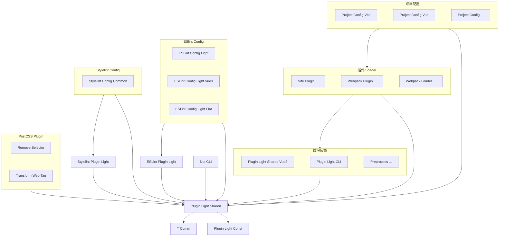

# 贡献指南

`plugin-light` 采用 `pnpm monorepo` 模式，灵感来自于 Vue3 和 Vite 项目。

开发前需对 `pnpm` 常用命令有基本了解。

## 1. 打包

以 `project-config-vite` 为例：

```bash
pnpm --filter=@plugin-light/project-config-vite build
```

升级依赖

```bash
# 在某个包中升级 一些依赖
pnpm --filter=@plugin-light/project-config-vite up "@plugin-light/*"

# 在所有包中只升级 某个依赖
pnpm --filter="./packages/*" up "@plugin-light/shared-vue2"

# 除了某个包外，其他包升级依赖
pnpm --filter="\!./packages/plugin-light-shared" up "@plugin-light/shared"
```

## 2. 文档

根据`jsdoc`生成文档：

```bash
npm run docs:gen
```

文档开发：

```bash
npm run docs:dev
```

文档打包：

```bash
npm run docs:build
```

文档部署：

```bash
npm run docs:deploy
```

## 3. monorepo

### 3.1. shared

`shared` 为 Vue2 和 Vue3 公用的。

`shared-vue2` 为 Vue2 独有的，可能会用到 `loader-utils`、`vue-template-compiler` 等库。

这样拆离是为了防止依赖版本冲突。

### 3.2. 依赖关系

`loader`、`plugin` 之间不能互相依赖，`project-config` 之间也是。如果有公用部分，请抽离到 `shared` 中。

`shared`、`loader`、`plugin`、`project-config` 等包依赖关系如下：

<!--  -->



运行时工具，不依赖 `plugin-light-shared`，独立于上面的子包。

### 3.3. loader 导出

每个 `loader` 有 3 个产物，外部可以使用。

1. index.js
2. loader.js
3. loader.prod.js

`index.js` 是具名导出，包含 `LOADER`、`LOADER_PROD` 两个变量，分别对应 `loader.js`、`loader.prod.js` 的文件路径，并导出 `loader` 的 `types`。

`loader.js` 和 `loader.prod.js` 分别是 `loader` 的非压缩版本和压缩版本。

## 4. 工程化

`plugin-light` 提供的很多工具都是围绕工程化来的。

工程化的目标是通过自动化、标准化和最佳实践，解放开发者的双手来提高相关事务的实现效率，同时大幅降低因频繁人工干预而导致出现问题的可能性。

## 5. 文档

- 文档链接一旦确认就不应该再更改，防止公布之后别人找不到
- "业务文档"章节中必须是与业务相关的，不允许纯感想，不允许学习笔记

## 6. 声明

作者：**novlan1**
