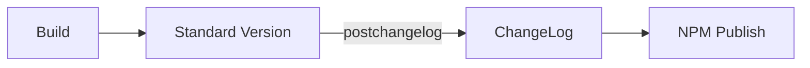

:::info 作者

novlan1

2025.9.30
:::

# 组件库脚手架

## 新组件

组件库脚手架至少包含：

1. 一键创建组件
2. 配置驱动，一键根据配置生成内容

生成内容包括：

1. 组件
2. 示例
3. 文档

更具体点

1. 组件内容
2. 组件 `index.ts`
3. 组件 `installer` （部分组件库包含）
4. 示例内容
5. 示例 `router`
6. 文档内容
7. 文档 `sidebar`

一键生成内容至少有两种模式：

1. 维护一个或多个方法，传入关键词，根据模板字符串生成所需内容
2. 维护一个或多个独立的模板文件，替换关键字

这里如何要生成的内容比较多时，推荐使用后者，更易维护，关注点分离。

生成后有两种覆盖模式：

1. 不管之前有没有，直接用新生成的覆盖
2. 先判断之前有没有，有了就跳过，没有再覆盖

前者使用场景包含：

1. 组件 `index.ts`
2. 组件 `installer`
3. 示例 `router`
4. 文档 `sidebar`

后者使用场景主要是各种具体的内容。

## 发布

发布类型

- 独立模式
  - 无需单独发布目录，如 T Comm
  - 需要单独发布目录，如 Press UI、Press Plus、Press Next、Press Pix
- `monorepo` 模式，如 Plugin Light、Press Components、PMD NPM

T Comm 发布流程

流水线发布和本地发布的不同：

- 多了校验，比如是否审核通过、`versionType` 是否有效、只有主分支才能发布 patch
- 多了 `getNewVersion`，本地写啥发啥，流水线需要计算（看上面版本升级）
- 多了 `pnpm i`
- 多了 `mkdir log`
- 多了 `git push`

> 发布非常重要，且多个项目差异性不大，统一放到 `plugin-light-cli` 管理，不只是工具方法，还包括所有脚本。
